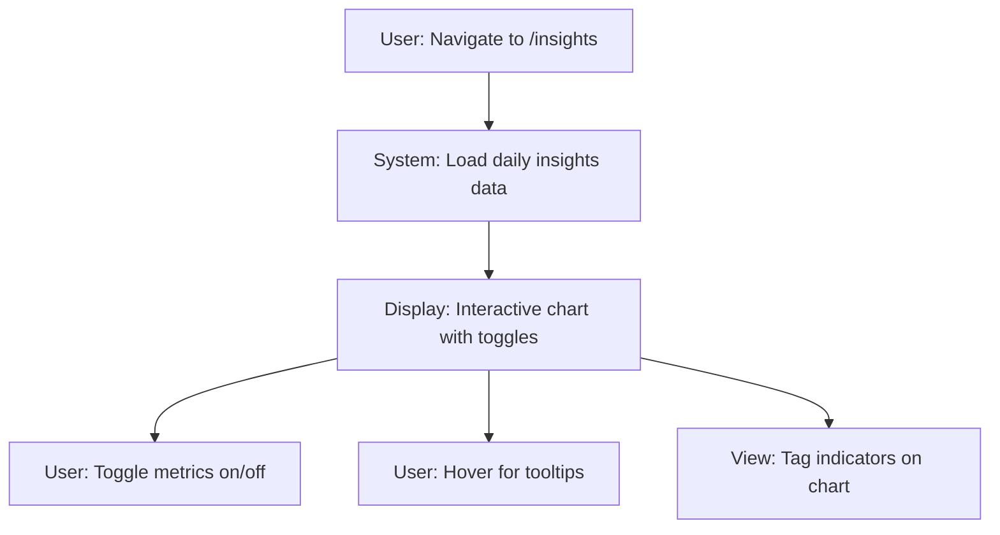

## 1. Product Overview
Upgrade FlowTrack's insights page from basic stats to interactive analytics with time-series charts showing correlations between flow state, sleep, and caffeine intake over time.

This helps users understand patterns between their physiological data and productivity flow states through visual data exploration.

## 2. Core Features

### 2.1 User Roles
| Role | Registration Method | Core Permissions |
|------|---------------------|------------------|
| Authenticated User | Email/Auth via Supabase | View own analytics data, toggle chart metrics |

### 2.2 Feature Module
The insights upgrade consists of the following main components:
1. **Interactive Chart**: Time-series visualization with multiple overlapping metrics (flow, sleep, caffeine)
2. **Metric Toggles**: Show/hide individual data series on the chart
3. **Data Helper**: Efficient data aggregation from sessions and physio_logs tables
4. **Tooltip Details**: Contextual information including scaled caffeine values and tag indicators

### 2.3 Page Details
| Page Name | Module Name | Feature description |
|-----------|-------------|---------------------|
| Insights | Interactive Chart | Display time-series chart with flow, sleep hours, sleep quality, and caffeine data over last 60 days. Toggle individual metrics on/off. |
| Insights | Metric Toggles | Pill-style buttons to show/hide each data series (Avg Flow, Sleep Hours, Sleep Quality, Caffeine). |
| Insights | Data Aggregation | Fetch and combine data from sessions (flow ratings) and physio_logs (sleep, caffeine) into daily insights. |
| Insights | Tag Indicators | Visual markers on chart for days with partner_sleepover or sick tags. |
| Insights | Tooltip Details | Show actual caffeine mg values alongside scaled chart values when hovering caffeine line. |

## 3. Core Process
User Flow:
1. User navigates to /insights page
2. System loads 60 days of aggregated daily data (flow, sleep, caffeine)
3. Interactive chart displays with all metrics visible by default
4. User can toggle individual metrics using pill buttons
5. Hovering chart shows detailed tooltips with actual values
6. Visual indicators show special tagged days (partner/sick)

## 4. User Interface Design
### 4.1 Design Style
- **Primary Colors**: Green (#10b981) for flow, Blue (#3b82f6) for sleep hours, Indigo (#6366f1) for sleep quality, Orange (#f97316) for caffeine
- **Button Style**: Pill-shaped toggle buttons with selected/unselected states
- **Font**: System default, small sizes (10-12px) for chart labels
- **Layout**: Card-based container with rounded corners and subtle border
- **Chart Style**: Clean line charts with grid, no dots, connected nulls

### 4.2 Page Design Overview
| Page Name | Module Name | UI Elements |
|-----------|-------------|-------------|
| Insights | Chart Container | Rounded-2xl border, white background, padding-4, max height 64 |
| Insights | Toggle Buttons | Flex wrap gap-2, text-xs, pill-style with background colors |
| Insights | Chart Area | ResponsiveContainer 100% width/height, Y-axis domain [0,10] |
| Insights | Tooltips | Custom formatter showing scaled and actual values for caffeine |

### 4.3 Responsiveness
Desktop-first design with responsive chart container that adapts to available width while maintaining readable chart dimensions.