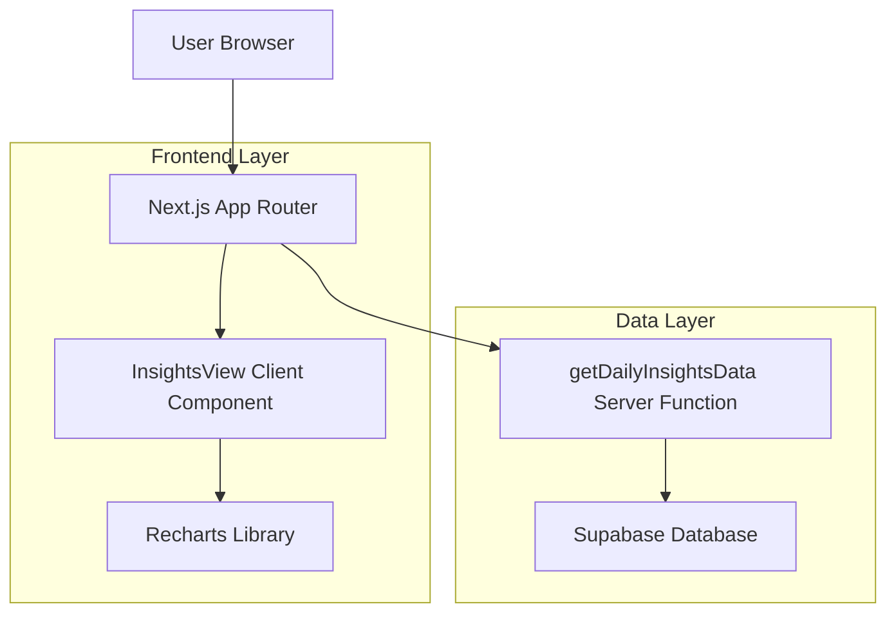
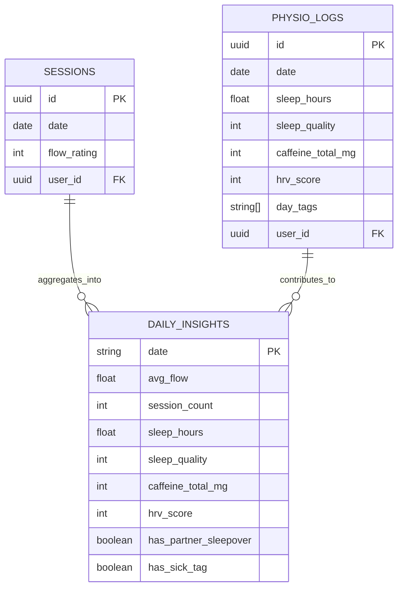

## 1. Architecture Design



## 2. Technology Description
- **Frontend**: Next.js 14 App Router + React 18 + TypeScript
- **Charting**: Recharts library for interactive time-series visualization
- **Database**: Supabase (PostgreSQL) with RLS policies
- **Data Access**: Supabase client SDK with server-side data aggregation
- **Styling**: Tailwind CSS for UI components and chart container

## 3. Route Definitions
| Route | Purpose |
|-------|---------|
| /insights | Analytics dashboard with interactive charts showing flow, sleep, and caffeine correlations |

## 4. API Definitions

### 4.1 Data Helper Function
```typescript
// lib/db/insights.ts
export async function getDailyInsightsData(
  supabase: SupabaseClient,
  options?: { days?: number }
): Promise<DailyInsightRow[]>
```

**Parameters:**
- `supabase`: SupabaseClient instance for database queries
- `options.days`: Optional number of days to fetch (default: 60)

**Returns:** Array of DailyInsightRow objects with aggregated daily metrics

## 5. Server Architecture Diagram

```mermaid
graph TD
    A[Next.js Server Component] --> B[getDailyInsightsData]
    B --> C[Sessions Query]
    B --> D[Physio Logs Query]
    C --> E[Aggregate by Date]
    D --> F[Map by Date]
    E --> G[Combine Data]
    F --> G
    G --> H[Return DailyInsightRow[]]
    
    subgraph "Data Aggregation Layer"
        B
        E
        F
        G
    end
    
    subgraph "Database Queries"
        C
        D
    end
```

## 6. Data Model

### 6.1 Data Model Definition


### 6.2 Data Definition Language
```sql
-- Daily insights is a computed view, no direct table creation needed
-- Existing tables used for aggregation:

-- Sessions table (existing)
CREATE TABLE sessions (
    id UUID PRIMARY KEY DEFAULT gen_random_uuid(),
    user_id UUID REFERENCES auth.users(id) ON DELETE CASCADE,
    date DATE NOT NULL,
    flow_rating INTEGER CHECK (flow_rating >= 0 AND flow_rating <= 10),
    created_at TIMESTAMP WITH TIME ZONE DEFAULT NOW()
);

-- Physio logs table (existing)
CREATE TABLE physio_logs (
    id UUID PRIMARY KEY DEFAULT gen_random_uuid(),
    user_id UUID REFERENCES auth.users(id) ON DELETE CASCADE,
    date DATE NOT NULL,
    sleep_hours DECIMAL(3,1),
    sleep_quality INTEGER CHECK (sleep_quality >= 0 AND sleep_quality <= 10),
    caffeine_total_mg INTEGER,
    hrv_score INTEGER,
    day_tags TEXT[],
    created_at TIMESTAMP WITH TIME ZONE DEFAULT NOW()
);

-- RLS Policies (existing)
ALTER TABLE sessions ENABLE ROW LEVEL SECURITY;
ALTER TABLE physio_logs ENABLE ROW LEVEL SECURITY;

-- Grant permissions
GRANT SELECT ON sessions TO authenticated;
GRANT SELECT ON physio_logs TO authenticated;
```

## 7. Component Structure

### 7.1 InsightsView Component Props
```typescript
interface InsightsViewProps {
  data: DailyInsightRow[];
}
```

### 7.2 Chart Data Transformation
```typescript
// Caffeine scaling for visualization
const caffeineScaled = row.caffeine_total_mg != null 
  ? Math.min(10, Number(row.caffeine_total_mg) / 50) // 0-500mg → 0-10
  : null;
```

### 7.3 Toggle State Management
```typescript
const [showFlow, setShowFlow] = useState(true);
const [showSleepHours, setShowSleepHours] = useState(true);
const [showSleepQuality, setShowSleepQuality] = useState(false);
const [showCaffeine, setShowCaffeine] = useState(true);
```